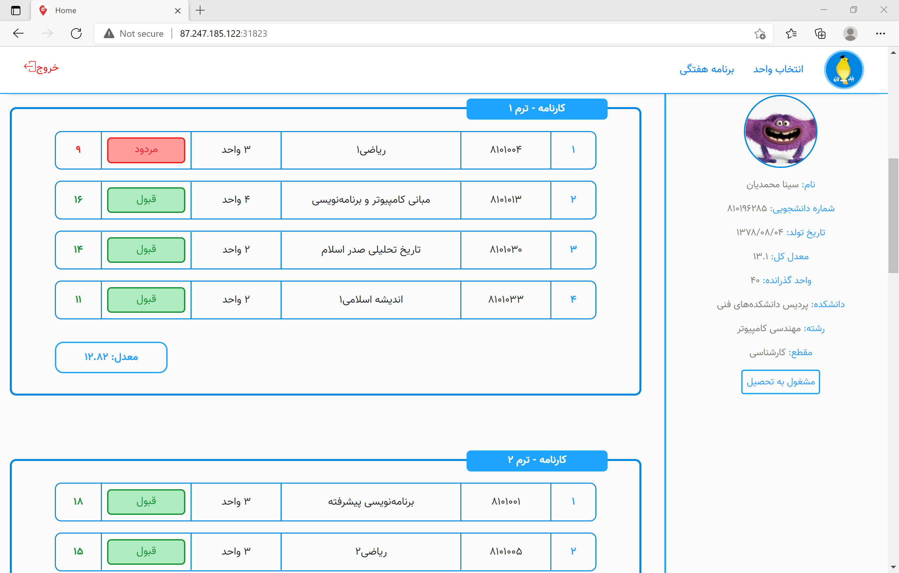
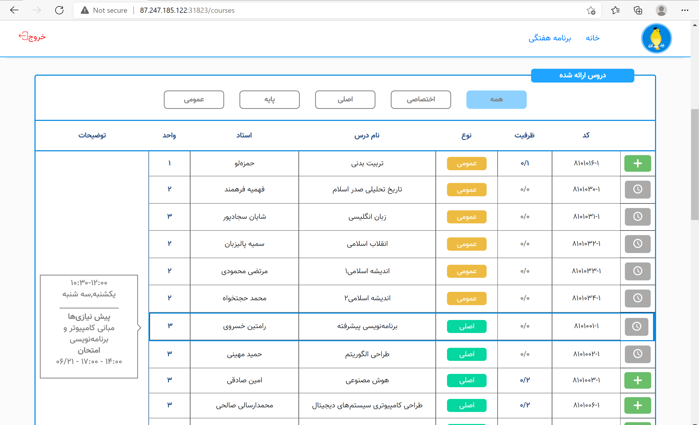
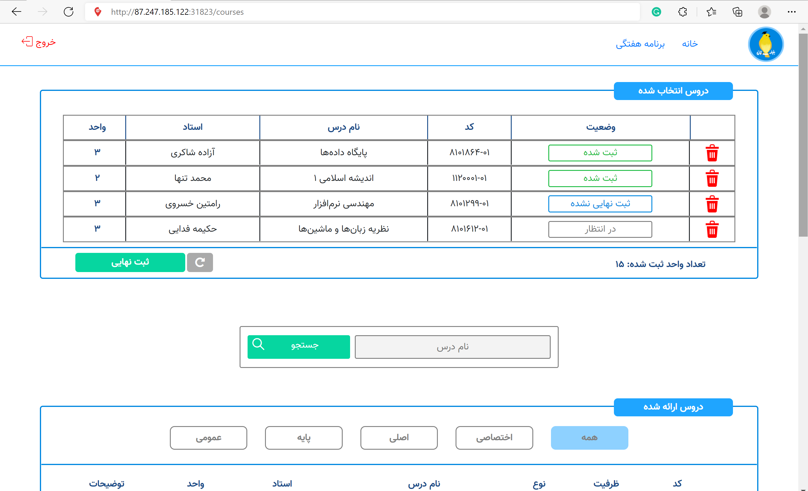
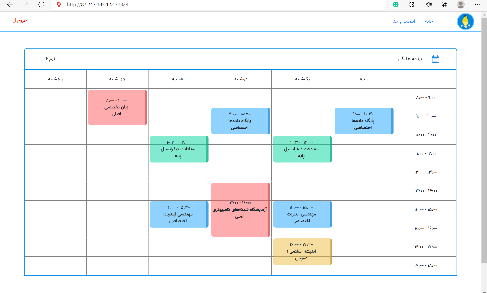
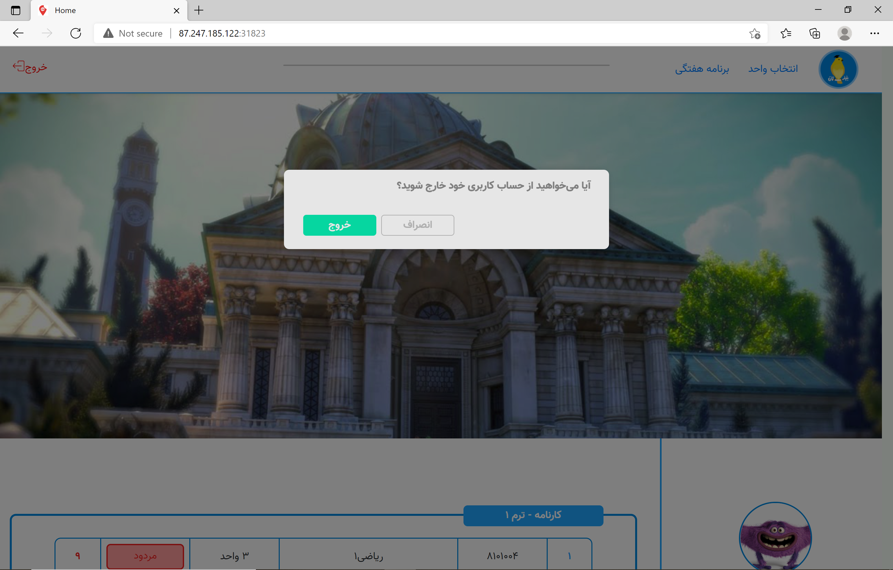

# Bolbolestan System

This repository contains the complete code for the Spring 2021 Internet Engineering project. In this project we aimed to implement a system like Golestan system (which is responsible for assigning courses to students, communication between professors and students, uploading of the grades and many more things). We used Java as the main language for the backend of our website and ReactJS was used to code the frontend. Each phase of the project is described breifly bellow:

1. CA1: Maven, JSON Domain, Unit Test(JUnit), Git
2. CA2: Simple Web Server, Javalin
3. CA3: Tomcat, MVC, Java Servlet, JSP
4. CA4: HTML, CSS, Bootstrap
5. CA5: CORS, Standard API, Spring, React, RIA
6. CA6: MySQL Database, JDBC
7. CA7: Authentication, Authorization(JWT), SQL Injection
8. CA8: Docker, Nginx
9. CA9: Kubernetes, CI/CD

## Project Description
The system we have developed has several features which we have listed bellow:
- User can sign in or sign up. Also if they forget their password, they can set a new password.
- User can see their report cards in the home page.
- User can select new courses for the new semester or delete a course they have previously selected. If the course they are selecting is full they can enter the waiting list, where they will automatically be assigned the course once a spot frees up.
- User can see the weekly schedule for their current semester (based on the courses they have selected).

## Screenshots

## Developers

* [**Ghazal Kalhor**](https://github.com/kalhorghazal)
* [**Rasta Tadayon**](https://github.com/rastadayon)

